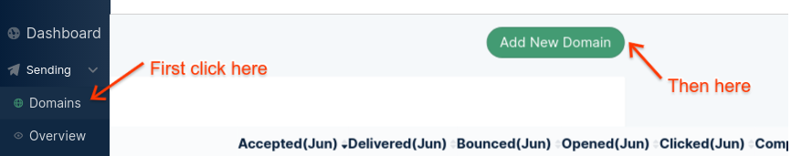
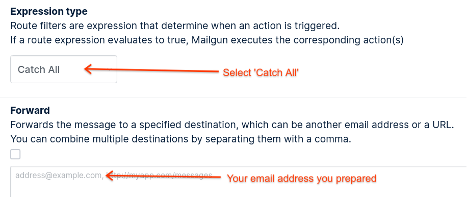
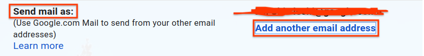
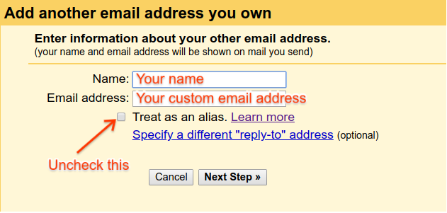
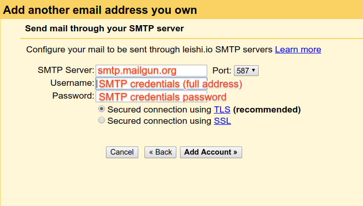

Bought you own domain? Do you want to send and receive emails with your own domain name? There are a couple of options out there, [G Suite](https://gsuite.google.com) for a minimun of $5/mo, or [zoho](https://www.zoho.com) will be cheaper for $1/mo, or maybe your domain provider will also provide support for email hosting, ranging from $2/mo to $5/mo. Excluding from serving your own eamil server, if you want a reliable email servie with your custom domain, there aren't a lot of choices there. Today, I will a way that you can send and receive emails with your own domain, and for totally free.

## Prerequisite

- A domain such as this super one [lowerCamelCase.com](https://www.lowercamelcase.com) and access to its DNS record.
- A email service that can support `Send Mail As`, [Gmail](https://mail.google.com) might be the most popular one, or you can choose your own preference as long as it supports adding another SMTP account.

## Now let's begin

### The mailgun part

The trick to send and receive emails for free is [mailgun](https://www.mailgun.com). So go to their website and signup for a new account. Your credit card won't be charged as long as the amount of your monthly emails stays in thier free cap. 

Once signed up and logged into their dashboard, go to `Sending > Domains`. The dashboard should appear on the left side. Now click `Add New Domain` and then input your domain name and select your region.

> If you want to send emails from your root domain, for example me@lowercamelcase.com, you should input lowercamelcase.com instead of mg.lowercamelcase.com though mailgun recommended so.

After adding your domain, follow the instructions shown on the page and go to your DNS provider to add those records. Then click `Verify DNS Settings`, if all the line items shows green, you're good to go.

Now back to the side bar and click `Receiving`, then click `Create Route`. In the `Expression Type`, select `Catch All`, enable this rule mailgun will forward all the emails send to `*@lowercamelcase.com`. In the forward section, simply add the email address you are going to receive.

Once you created the route, you should be able to receive emails by your domain, try and send one to verify!

### The gmail part

> The following should also applied to other email service as long as they provide support for importting other SMTP accounts.

Inside the gmail, go to `Settings > Accounts` and find a section named `Send mail as`. Click `Add another email address`.

In the popup, input your name and custom domain email address, remember to uncheck `Treat as an alias`.

Click `Next Step`, then input mailgun's SMTP server address and port as shown, and input your custom domain email address and password, you should be able to get that after domain verification. If you don't, in mailgun, go to `Sending > Domain Settings > SMTP credentials`.

Now you're all set! Try compose a new email and you will see a dropdown in the `From` which will alow you to send with another email address inside gmail, hooray!
