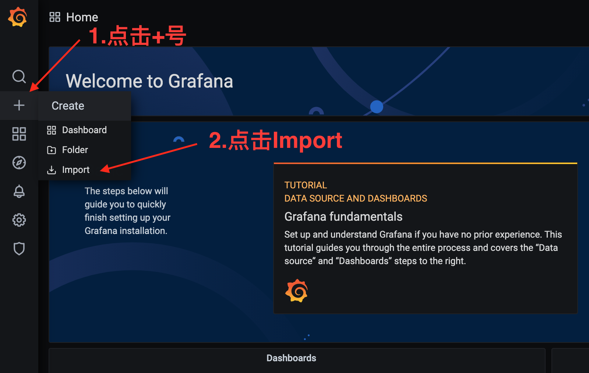

本文将教你如何用Grafana和Promethus搭配订制的node-exporter搭建一个用于统计V2ray和iptables端口转发流量的面板，最终效果如下：


## 准备工作

### 开启V2ray统计功能

修改V2ray的配置文件，一般位于`/etc/v2ray/config.json`或`/usr/local/etc/v2ray/config.json`，添加如下几行配置：

```json
{
  ...
  "stats": {},
  "api": {
    "tag": "api",
    "services": ["StatsService"]
  },
  "policy": {
    "levels": {
      "0": {
        "statsUserUplink": true,
        "statsUserDownlink": true
      }
    },
    "system": {
      "statsInboundUplink": true,
      "statsInboundDownlink": true
    }
  },
  "inbounds": [
    ...
    {
      "listen": "127.0.0.1",
      "port": 10085,
      "protocol": "dokodemo-door",
      "settings": {
        "address": "127.0.0.1"
      },
      "tag": "api"
    }
    ...
  ],
  "routing": {
    "settings":{
      "rules": [
        ...
        {
          "inboundTag":[
            "api"
          ],
          "outboundTag":"api",
          "type":"field"
        }
        ...
      ],
      ...
    },
    ...
  }
}
```

最重要的几个变化是：
- 添加`"stats: {}"`和`"api": {"tag": "api", "services": ["StatsService"]},`
- 在`inbounds`里添加一个`tag`为`api`的`dokodemo-door`，端口可以任意，记着后面要用
- 在`routing`里把`inputTag`为`api`的流量设置`outpuTag`
- `policy`的`levels`需要添加所有用户的`level`(上述例子里只开启了`level`为`0`的流量统计功能)
- **非常重要**：每个inbound设置一个`tag`，每个`client`设置好email

> 完成设置后可以通过`v2ctl api --server=127.0.0.1:10085 StatsService.QueryStats 'pattern: "" reset: false'`来验证流量统计是否开启

> 更多有关v2ray开启流量统计的设置可以参考[V2ray 白话文指南](https://guide.v2fly.org/advanced/traffic.html#%E6%B5%81%E9%87%8F%E7%BB%9F%E8%AE%A1)


### 开启iptables转发端口的流量统计

首先先确定你的iptables端口转发是通过`SNAT/DNAT`来实现，如果没有的话，可以参考[监控gost/socat/brook中转的流量](#监控gostsocatbrook中转的流量)自己添加统计功能。查看iptables的配置确认一下大概会看起来像这样：
```shell
iptables -t nat -L
Chain PREROUTING (policy ACCEPT)
target     prot opt source               destination
DNAT       tcp  --  anywhere             anywhere             tcp dpt:11111 to:8.8.8.8:10000

Chain INPUT (policy ACCEPT)
target     prot opt source               destination

Chain OUTPUT (policy ACCEPT)
target     prot opt source               destination

Chain POSTROUTING (policy ACCEPT)
target     prot opt source               destination
SNAT       tcp  --  anywhere             8.8.8.8      tcp dpt:10000 to:192.168.1.1
```

定义本地端口为`PORT`，远端IP为`REMOTE_IP`，远端端口为`REMOTE_PORT`，再添加如下两条iptables规则：
```shell
iptables -A FORWARD -p tcp -d REMOTE_IP --dport REMOTE_PORT -j ACCEPT -m comment --comment "UPLOAD PORT->REMOTE_IP:REMOTE_PORT"
iptables -A FORWARD -p tcp -s REMOTE_IP -j ACCEPT -m comment --comment "DOWNLOAD PORT->REMOTE_IP:REMOTE_PORT"
```

`--comment`里的内容特别重要，是用来区分流量的唯一依据，你也可以使用[这个](https://github.com/LeiShi1313/v2ray-iptables-exporter/blob/master/iptables.sh)脚本来添加端口转发，这个脚本会自动添加上述两条规则，用法：
```shell
bash iptables.sh forward PORT REMOTE_IP REMOTE_PORT
```

检查一下统计功能：
```shell
iptables -nxvL

Chain INPUT (policy ACCEPT 19366 packets, 15977101 bytes)
    pkts      bytes target     prot opt in     out     source               destination

Chain FORWARD (policy ACCEPT 0 packets, 0 bytes)
    pkts      bytes target     prot opt in     out     source               destination
     223    11604 ACCEPT     tcp  --  *      *       0.0.0.0/0            8.8.8.8      tcp dpt:10000 /* UPLOAD 11111->8.8.8.8:10000 */
     146     7600 ACCEPT     tcp  --  *      *       8.8.8.8      0.0.0.0/0            /* DOWNLOAD 11111->8.8.8.8:10000 */

Chain OUTPUT (policy ACCEPT 15543 packets, 9129206 bytes)
    pkts      bytes target     prot opt in     out     source               destination
```
注意`bytes`这一栏是不是大于零（如果本来就没有流量的话，可以telent一下这个端口）,和注释里的端口/IP是否正确


## 安装Promethus node exporter

这是最简单的部分，因为我已经写好了，直接根据自己的平台到[这里]()下载对应的binary，运行就可以了：

> 注意这些操作都需要在root下运行

```shell
wget -O /tmp/node-exporter https://github.com/LeiShi1313/node_exporter/releases/download/v1.1.1/node_exporter_linux-amd64
mv /tmp/node-exporter /usr/local/bin
chmod +x /usr/local/bin/node-exporter
nohup node-exporter --collector.iptables --collector.v2ray --collector.v2ray.endpoint="127.0.0.1:10085" > /dev/null 2>&1 &
```


测试一下node exporter是否正常运行：
```shell
curl localhost:9100
<html>
<head><title>Node Exporter</title></head>
<body>
<h1>Node Exporter</h1>
<p><a href='/metrics'>Metrics</a></p>
</body>
</html>
```

### 利用systemd更科学地管理node exporter

```shell
cat > /etc/systemd/system/node-exporter.service <<EOF
[Unit]
Description=Node Exporter with V2ray and Iptables collector
After=network-online.target
Wants=network-online.target

[Service]
User=root
ExecStart=/usr/local/bin/node-exporter --collector.iptables --collector.v2ray --collector.v2ray.endpoint="127.0.0.1:10085"

[Install]
WantedBy=multi-user.target
EOF
systemctl daemon-reload
systemctl enable node-exporter
systemctl start node-exporter
```

## Grafana & Promethus

### 启动服务

这一步也比较简单，使用docker-compose up -d就可以了，`docker-compose.yml`我也[写好了](https://github.com/LeiShi1313/docker-composes/tree/master/grafana_promethus)

```shell
git clone https://github.com/LeiShi1313/docker-composes.git
cd docker-composes/grafana_promethus
```

首先编辑下`promethus.yml`:
```yaml
global:
  scrape_interval: 10s

- job_name: v2ray
  metrics_path: /scrape
  static_configs:
  - targets: ['**被监控的服务器IP地址**:9550']
  - targets: ['**被监控的另一台服务器IP地址**:9550']
``` 

然后`docker-compose up -d`就可以了，打开浏览器看看**Grafana服务器IP**:3000有没有起来，然后用`admin`/`admin`登录就可以了。

### 添加流量统计面板

首先添加一个面板，`+`->`Import`：


然后在`Import via panel json`里复制粘贴[这里](https://github.com/LeiShi1313/v2ray-iptables-exporter/blob/master/dashboard.json)的内容，随便起个名字，点击`Import`就可以了


## 进阶玩法

### 监控gost/socat/brook中转的流量
[请移步](/blog/posts/2020-08/Monitoring-forwarded-traffic/)

### 添加离线报警，超速警告
[TODO](./404.html)

### 修改exporter，监控其他metrics
[TODO](./404.html)