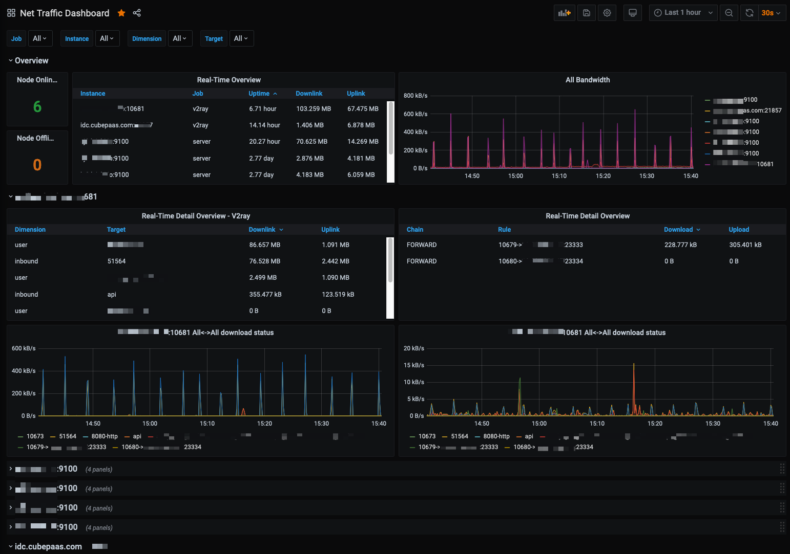
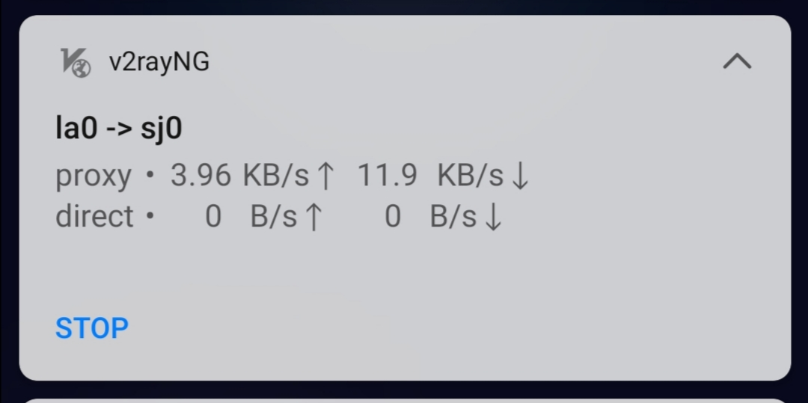
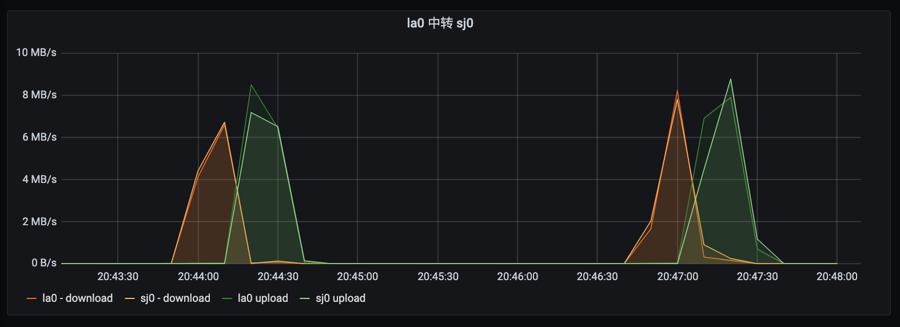
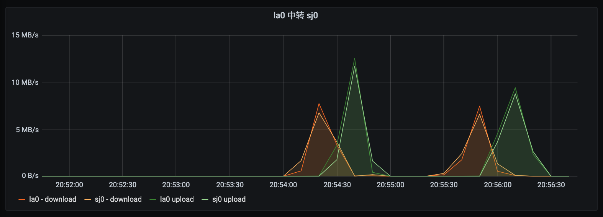
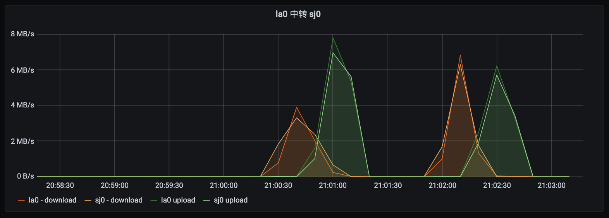

除了使用iptables来进行端口转发，很多人会使用各种软件来进行中转，例如[gost](https://github.com/ginuerzh/gost)，socat，[brook](https://github.com/txthinking/brook)。有的自带流量统计，有的没有，但都可以通过iptables实现流量统计，配合[Grafana+Prometheus](/blog/posts/2020-08/Making-A-Traffic-Panel-Using-Grafana-And-Promethus/)，可以做出好看的流量统计面板。



## 添加iptables规则

首先查看下默认网卡的绑定的ip：
```shell
# 查看默认网卡
ip route show | grep default | awk '{print $5}'
# 假设默认网卡为eth0，查看其绑定的ip
ip address show eth0 scope global |  awk '/inet / {split($2,var,"/"); print var[1]}'
```

假设中转的规则是`443->8.8.8.9:444`，假设默认网卡绑定的ip是`8.8.8.8`，添加如下两条规则就可以让iptables显示经过这条中转规则的流量：
```shell
export INET=8.8.8.8
export LOCAL_PORT=443
export REMOTE_IP=8.8.8.9
export REMOTE_PORT=444
iptables -A INPUT -p tcp -d $INET --dport $LOCAL_PORT -m comment --comment "UPLOAD $LOCAL_PORT->$REMOTE_IP:$REMOTE_PORT"
iptables -A INPUT -p tcp -s $REMOTE_IP -d $INET -m comment --comment "DOWNLOAD $LOCAL_PORT->$REMOTE_IP:$REMOTE_PORT"
```

> 运行`iptables -nxvL`查看一下流量统计有没有起作用

如果不想自己手写iptables规则，也可以用我写的[脚本](https://raw.githubusercontent.com/LeiShi1313/net-traffic-exporter/master/iptables.sh)：
```shell
bash iptables monitor LOCAL_PORT REMOTE_IP REMOTE_PORT
```

## Grafana+Promethus流量统计面板

见[前文](/blog/posts/2020-08/Making-A-Traffic-Panel-Using-Grafana-And-Promethus/)，如果已经全部搭好，应该已经可以看到经过的流量了。下面我分别用gost/socat/brook来试试看流量统计的效果。

### gost
首先我在`sj0.leishi.io`上搭建个`ws+tls`的v2ray节点，然后通过`la0.leishi.io`来中转：
```shell
lei@la0:~$ gost -L tcp://:10003/sj0.leishi.io:443
```

添加流量统计的iptables规则，查看有没有生效：
```shell
lei@la0:~$ bash iptables monitor 10003 193.160.32.136 443
lei@la0:~$ sudo iptables -nvxL
Chain INPUT (policy ACCEPT 0 packets, 0 bytes)
    pkts      bytes target     prot opt in     out     source               destination
       0        0            tcp  --  *      *       0.0.0.0/0            107.175.63.10        tcp dpt:10003 /* UPLOAD 10003->193.160.32.136:443 */
       0        0            tcp  --  *      *       193.160.32.136       107.175.63.10        tcp spt:443 /* DOWNLOAD 10003->193.160.32.136:443 */

Chain FORWARD (policy ACCEPT 0 packets, 0 bytes)
    pkts      bytes target     prot opt in     out     source               destination

Chain OUTPUT (policy ACCEPT 0 packets, 0 bytes)
    pkts      bytes target     prot opt in     out     source               destination
```

测试v2ray是否能连接


测两次速看看统计的效果，`la0 download/upload`是iptables的流量，`sj0 download/upload`是v2ray自带的流量统计功能：



### socat

再试试socat
```shell
lei@la0:~$ socat TCP4-LISTEN:10003,reuseaddr,fork TCP4:193.160.32.136:443
```

同样测两次速看看：

可以看到两端的流量统计基本符合

### brook

我们再试试看brook中转的流量统计：
```shell
lei@la0:~$ brook relay -f :10003 -t sj0.leishi.io:443
```

> 注意，如果使用的是一键脚本，可能已经有添加iptables规则，删除即可

测两次速，再看一眼流量统计：


## 总结
如上的iptables规则能很好地用来统计中转的流量，配合Grafana搭建的面板，能够实时地查看服务器上各个端口的流量情况。