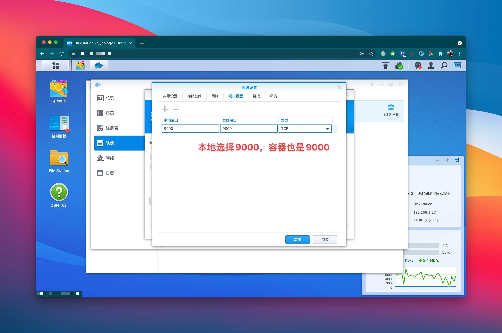

本文将教你如何用Grafana和Promethus搭配订制的exporter在群晖搭建一个用于统计qBittorrent/Deluge/Transmission流量的面板，最终效果如下：


## 准备工作

1. 请准备一台群晖，安装/开启docker
2. 准备个文本编辑器用于编辑配置文件
3. 准备好你所有下载的用户名/密码并确保可联通

## 准备配置文件

新建一个文本并取名为`config.yml`，并按下图输入你下载器的登陆信息，现在支持`qBittorrent`/`Deluge`/`Transmission`


然后将此文件上传到群晖，建议上传到docker这个共享文件夹内


## Docker安装并启动downloader-exporter

在群晖Docker的`映像`页面，选择新增一个映像，URL输入`https://hub.docker.com/r/leishi1313/downloader-exporter`


完成下载后你的Docker页面应该像这样


选中映像并点击启动，选择`高级设置` -> `存储空间` -> `添加文件`


讲刚才添加的配置文件挂载到`/config/config.yml`上


在`端口设置`页面，本地端口填上`9000`（或者你自己喜欢的端口）



准备就绪，一路下一步，然后到`群晖IP:9000`确认下是否有如下页面


## Docker安装Prometheus

### 准备配置文件

新建一个文本并取名为`prometheus.yml`，并按下图输入你上一步的IP+端口


然后将此文件上传到群晖，名为docker的这个共享文件夹内（**重要**）


### Docker

同样的，在群晖Docker的`映像`页面，选择新增一个映像，URL输入`https://hub.docker.com/r/prom/prometheus`，现在你的映像这一栏应该至少有2个映像


同样，在高级设置把刚才的配置文件挂载到`/etc/prometheus/prometheus.yml`这个地址


别忘了在端口设置同样把`9090`映射出来，然后浏览器去到`群晖IP:9090`，看到如下页面并且状态是`UP`就算成功


## Docker安装Grafana

如上2步，我们再添加一个映像，这次的URL输入`https://hub.docker.com/r/grafana/grafana`，现在你应该有至少3个映像，放心，这是最后一个了


然后在高级设置，把`3000`映射到本地即可


启动映像，浏览器去到`群晖IP:3000`看看面板有没有正确启动，用`admin`/`admin`作为用户名密码登录


## 配置面板

### 配置数据源

在面板的设置选项，点击`Data sources`


添加我们刚才启动的`Prometheus`作为数据源


填写`群晖IP:9090`作为数据源地址


在最后测试并保存此数据源


### 新建面板

终于到了最激动人心的步骤了，我们回到主页点击`+`号，选择`Import`


在`Import via grafana.com`选项，输入`15006`


然后配置下面板的名称，选择刚才添加的数据源


然后，就没有然后了，如果所有步骤确认无误，你应该可以看到所有的数据了


## 常见问题

### 我的下载器太多了，获取一次数据要10秒钟以上，怎么办？

你可以利用[multi-target-exporter](https://prometheus.io/docs/guides/multi-target-exporter/)来实现通过一个端口获取不同的数据，例如：
```yaml
global:
  scrape_interval: 10s

scrape_configs:
- job_name: downloader-exporter
  static_configs:
    - targets:
      - qb1 # 对应配置里你自定义的下载器名称
      - qb2
      - de1
  relabel_configs: # 这整段可以照抄
    - source_labels: [__address__]
      target_label: __param_name
    - source_labels: [__param_name]
      target_label: instance
    - target_label: __address__
      replacement: 192.168.1.27:9000 # downloader-exporter的IP和端口
```

### 某个下载器获取数据太慢了，老是timeout怎么办？

你可以创建多个job，每个job采用不同的timeout时间，例如：
```yaml
global:
  scrape_interval: 10s

scrape_configs:
- job_name: downloader-exporter # 把获取时间比较快的放在这个job里
  static_configs:
    - targets:
      - qb1
      - qb2
  relabel_configs:
    - source_labels: [__address__]
      target_label: __param_name
    - source_labels: [__param_name]
      target_label: instance
    - target_label: __address__
      replacement: 192.168.1.27:9000
- job_name: slower-downloader-exporter # 把获取时间比较慢的放在这个job里
  scrape_interval: 2m # 把获取间隔改到2分钟
  scrape_timeout: 1m # 把timeout改大到1分钟
  static_configs:
    - targets:
      - tr1
      - tr2
  relabel_configs:
    - source_labels: [__address__]
      target_label: __param_name
    - source_labels: [__param_name]
      target_label: instance
    - target_label: __address__
      replacement: 192.168.1.27:9000
```
