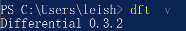

经常在PT站发种的一定经历过这样情景，已经辛辛苦苦地制作好了一个资源，在发布的页面又开始手忙脚乱，需要找个稳定可用的PTGen来生成豆瓣信息，需要打开MediaInfo/BDInfo来生成资源的音视频信息，需要打开Potplayer等软件来制作截图，然后还需要打开若干个页面来上传截图，与此同时，还要打开制种软件制作种子，最后，所有的这些步骤产生的信息都需要复制到发布页面，一旦需要同时发布比较多的种子，冗长的发布流程和繁杂的信息获取就成了“最后一公里”，繁杂枯燥，看似胜利就在眼前，但却也最容易出错。
<br/>

[Differential差速器](https://github.com/LeiShi1313/Differential)就是为了解决这“最后一公里”，应运而生的快速发种工具。只要提供给差速器一个需要发布的文件夹和豆瓣信息页面，差速器会自动帮你

1. 根据豆瓣链接获取PTGen信息
2. 根据资源载体获取MediaInfo/BDInfo信息
3. 截取自定数量的无损截图，上传到指定的图床
4. 制作种子
5. 如果是本地环境，自动打开浏览器，然后自动填充所有的信息

<br/>


<br/>

接下来，本文将分成一下几个部分讲解差速器的原理和使用：

- [PT发种流程简介](#pt发种流程简介)
- [安装Differential差速器](#安装differential差速器)
  - [Windows](#windows)
  - [Mac OS](#mac-os)
  - [Linux](#linux)
  - [Docker](#docker)
- [配置差速器](#配置差速器)
- [差速器的使用](#差速器的使用)
  - [日常使用](#日常使用)
  - [高阶使用](#高阶使用)
- [编写差速器插件](#编写差速器插件)

## PT发种流程简介

PT发种的流程一般可以概括成以下几个流程：

1. 资源的获取，常见的获取源一般为Bluray/DVD自购光碟、WEB-DL流媒体下载、HDTV电视录制、Encode压制，以及转载
2. 规范化命名，具体的命名标准写起来估计能有[几十页](https://scenerules.org/)，比较常见的电影命名格式为\[电影名称\].\[来源\].\[发行年份\].\[视频编码\].\[音频编码\]-\[组名\]
3. 元数据的整理/准备，比如包括在种子文件夹中的海报、nfo、截图等
4. 制作种子
5. 发布页面：填写电影主标题、副标题
6. 发布页面：填写电影豆瓣/imdb连接
7. 发布页面：填写电影介绍，经常由[PTGen](https://github.com/Rhilip/pt-gen-cfworker)从豆瓣页面生成
8. 发布页面（如果是压制作品）：填写压制的参数和encoder的log
9. 发布页面：填写截图的链接
10. 发布页面：填写资源的类型、来源、音视频编码，加上便于区分的标签等
11. 发布页面：上传生成的种子文件、元数据比如nfo等
12. 点击发布！

<br/>

可以看到，资源的获取和制作已属不易，资源的规范化发布也是困难重重，很容易出错。差速器的诞生就是为了解决这个问题，配置好的差速器可以自动化上述流程中的2-10步，大大简化发布流程，让发种不再让人头疼！

## 安装Differential差速器

差速器可以在任何具有Python环境的系统上使用，下面讲解下在各个系统上的安装步骤

### Windows

1. [安装Python](https://www.python.org/downloads/)，一般选择最新版本的Python3及对应的`Windows installer`即可。安装时注意将**为所有用户安装**和**将Python添加到PATH**勾上 
   1. 打开PowerShell，确认Python安装成功 
2. 下载安装`ffmpeg` & `ffprobe`：https://ffmpeg.org/download.html#build-windows
   1. 将下载的ffmpeg.exe和ffprobe.exe路径添加到系统PATH
   2. 如果你不会添加PATH，将ffmpeg.exe和ffprobe.exe复制到你的工作目录中，这个目录也是将来保存差速器配置的目录，`C:\Users\用户名`就是个不错的选择
   3. 在PowerShell确认ffmpeg和ffprobe安装成功  
3. 安装差速器，在PowerShell中输入：`python.exe -m pip install --upgrade Differential`，然后确认差速器安装成功 

### Mac OS

1. 安装[Homebrew](https://brew.sh/)，在`Termial.app`中输入：
```shell
/bin/bash -c "$(curl -fsSL https://raw.githubusercontent.com/Homebrew/install/HEAD/install.sh)"
```
2. 安装`ffmpeg`和`mediainfo`，并确认安装正确
```shell
brew install ffmpeg mediainfo
ffmpeg -version
mediainfo --version
```
3. 如果有扫描原盘的需求，还需要[安装Mono](https://www.mono-project.com/docs/getting-started/install/mac/)，安装完成后同样在`Terminal.app`中确认安装正确：
```shell
mono --version
```
4. 安装差速器，在`Terminal.app`中输入：
```shell
python3 -m pip install --upgrade Differential
dft -v
```

### Linux

大部分的发行版安装流程大同小异，本文将以Debian/Ubuntu作为例子，安装将全程在命令行界面完成
1. 安装`python3`、`python3-pip`、`ffmpeg`以及`mediainfo`：
```shell
sudo apt update && sudo apt install python3 python3-pip ffmpeg mediainfo
```
2. 如果有扫描原盘的需求，[安装Mono](https://www.mono-project.com/download/stable/#download-lin)，请根据自己对应的系统安装
3. 安装差速器并检查差速器版本：
```shell
python3 -m pip install --upgrade Differential
dft -v
```

### Docker

差速器在将来也会提供`Docker`版本，敬请期待


## 配置差速器

差速器可以同时接受从命令行和配置文件传入的参数，为简化差速器的使用，建议将大部分可复用的配置，比如图床、截图张数等写入配置文件。差速器默认会从当前文件夹下的`config.ini`读取配置

> **请务必将配置文件命名为config.ini**

差速器的配置是标准的[.ini](https://en.wikipedia.org/wiki/INI_file)文件，差速器配置文件的一般结构如下：
```ini
[DEFAULT]
默认参数A=AAA
默认参数B=BBB

[插件1]
插件1参数A=XXX
插件1参数C=CCC                                                          

[插件2]
插件2参数A=YYY
插件2参数D=DDD                                                          
```
`[DEFAULT]`栏中的参数所有插件（有关插件将在差速器使用的章节解释）共享，适合放入图床配置的相关参数，各个插件对应的参数如果和默认参数相同，则会覆盖默认参数，这在不同站点要求不同的截图张数时很有用。

建议在你平时的工作目录放置你的配置文件，工作目录可以是命令行后打开的默认文件夹（在Windows这个目录是`C:\Users\用户名`，在Mac/Linux这个目录是`/home/用户名`）

差速器的Github页面带有一份[示例参数文件](https://github.com/LeiShi1313/Differential/blob/main/config.ini.example)，你可以复制下来，按需填写。同时也可以参考如下来配置差速器：

```ini
[DEFAULT]
; 是否制种
make_torrent = true

; 生成截图的数量
screenshot_count = 6
; 图床，差速器支持PTPIMG、自建imgurl、自建Chevereto（z4a、imgbb、猫柠的图床等）、SM.MS和BYR作为图床
image_hosting = CHEVERETO
; 自建Chevereto的地址
chevereto_hosting_url = https://XXX.com
; 自建Chevereto的用户名
chevereto_username = XXXX
; 自建Chevereto的密码
chevereto_password = YYYY

; 自动填充使用的脚本，这里使用树大的脚本
easy_upload = true
; 也可以使用明日大的脚本来进行自动填充
; auto_feed = true

; 使用差速器自带的短网址服务
use_short_url = true

; 差速器自带一个自建的PTGen，如果无法访问，可以提供自定义PTGen地址
;ptgen_url = https://XXXXX.com

[NexusPHP]
; 发种页面的链接
upload_url = https://XXXXX.com/upload.php
```

## 差速器的使用

### 日常使用
配置完成后，差速器的使用十分简单，打开命令行，移动到你的工作目录（即你的配置文件所在的目录），然后
```shell
dft ne -f [种子文件夹] -u [豆瓣链接]
```
即可

### 高阶使用

你可能注意到了，`dft`命令之后带了个`ne`，这其实是`NexusPHP`插件的简写，对应了配置文件的`[NexusPHP]`的section。差速器可以适配不同的站点/官组，这些都以插件的形式存在。差速器现在支持的插件可以通过以下命令来查看：
```shell
dft -h
```

出于保护站点的考虑，具体支持的插件请自行执行命令查看，也可以到[差速器的Github页面](https://github.com/LeiShi1313/Differential/tree/main/differential/plugins)来查看。每个插件也都有各自对应参数，你可以在配置文件里为每个插件添加不同的参数，就像上面示例配置的`[NexusPHP]`的`upload_url`参数一样。

`NexusPHP`（`Gazelle`和`Unit3D`插件其实和`NexusPHP`插件完全相同）将会是你最常用的插件，其他插件多是为了省略填写`upload_url`而存在，而带官组名字的插件则适配了各站官组的发种格式，普通用户一般用不到。

各个插件的参数可以以下命令来查看：
```shell
dft [插件名称] -h
```

> 注意：命令行参数以`-`分隔，而配置文件的参数以`_`分隔

## 编写差速器插件

TODO
